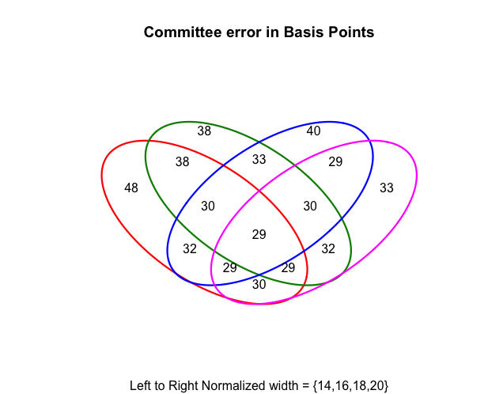

Reproducing MNIST results in [Ciresan 2012](http://arxiv.org/abs/1202.2745) with Theano
---

The code here builds on top of 3 supervised learning [theano tutorials](http://deeplearning.net/tutorial/) and another [library](https://github.com/rakeshvar/theanet) to implement the [best result](http://yann.lecun.com/exdb/mnist/) for classifying the famous mnist dataset at the time of writing.

The prediction process consists of:

- preprocessing
    - digit width normalization
    - elastic distortion of digits at train time
        - 
        - Multiple elastic distortions with sigma 8
- training DNN with SGD
    - 1x29x29-20C4-MP2-40C5-MP3-150N-10N
- testing with a committee of 35 Nets (5 nets per 7 choices of width normalization)

## Usage:

Params order:

- batch_size
- normalized_width
- distortion
- cuda_convnet
- init_learning_rate
- n_epochs

Train: `python code/ciresan2012.py 128 20 1 1 0.2`

Test: `python code/test_ciresan2012.py 0 model1.pkl model2.pkl ...`

### Dependencies:

#### theanet for distortion=1 option

`git submodule update --init`

#### pylearn2 for cuda_convnet=1 option (GPU only)

`sudo apt-get install -y python-yaml && git clone git://github.com/lisa-lab/pylearn2.git && cd pylearn2/ && sudo python setup.py develop`

## Results (So far):

Our best result is an error of 0.29%.

*This figure shows the error in basis points on 10,000 test points from various combinations of trained network columns. The only difference between the 4 individual pictured columns is the normalized width of the training set, which progresses from 14 to 20, left to right, by 2. The best result pictured is an error of 29 basis points, i.e. an **error of 0.29%**, from a 4 column network (all 4 normalized widths), and combinations of other columns ({14,18,20}, {14,16,20}, and {18,20}). This figure was made by `venn_diagram.r` (data generated by `4way_test_ciresan2012.py`)*

As we would expect, a larger normalized width improved results.

#### A table of various trials run:

Trial times are from a Nvidia Tesla C2075.

| Batch Size | Init Learning Rate | Norm. Width | Distortion Sigma | Distortion Alpha | # itr     | val err % | test err % | min | epochs |
|------------|--------------------|-------------|------------------|------------------|-----------|-----------|------------|-----|--------|
| 300        | 0.001              | 20          | NA               | NA               | 274,000   | 2.34      | 2.64       | 118 | 547    |
| 1000       | 0.001              | 20          | NA               | NA               | NA        | NA        | 11         | 60  | NA     |
| 50         | 0.001              | 20          | 6                | 36               | 800,000   | 2.85      | 3.46       | 366 | 800    |
| 100        | 0.001              | 20          | 8                | 36               | 400,000   | 4.01      | 4.79       | 243 | 800    |
| 50         | 0.001              | 20          | 8                | 36               | 752,000   | 2.57      | 3.44       | 231 | 751    |
| 25         | 0.001              | 20          | 8                | 36               | 1,600,000 | 1.82      | 2.04       | 310 | 800    |
| 12         | 0.001              | 20          | 8                | 36               | 3,500,000 | 1.25      | 1.59       | 553 | 800    |
| 12         | 0.001              | 18          | 8                | 36               | 3,500,000 | 1.33      | 1.59       | 554 | 800    |
| 12         | 0.001              | 16          | 8                | 36               | 3,500,000 | 1.38      | 1.79       | 553 | 800    |
| 12         | 0.001              | 14          | 8                | 36               | 3,500,000 | 1.47      | 1.93       | 553 | 800    |
| 128        | 0.01               | 20          | 8                | 36               | NA        | 4.04      | 5.22       | 140 | 800    |
| 128        | 0.2                | 20          | 8                | 36               | 186,000   | 0.31      | 0.79       | 77  | 431    |

*Note: 1) the decrease in train time between data rows 4 and 5 although the batch size decreased from 100 to 50. This is due to switching to a faster convolution implementation from [cuda-convnet](https://code.google.com/p/cuda-convnet/) via [py2learn](http://benanne.github.io/2014/04/03/faster-convolutions-in-theano.html). 2) the higher errors in this table (relative to errors in the Venn Diagram and elsewhere) are due to distortion being applied to the input data for all sets during the training script (no distortion is applied outside of training). 3) Error on smaller normalized width increases, since the fixed distortion params lead to more severe distortion on smaller digits. 4) Only after the 10th data row did we stray from the learning rate hyper-parameter specified by Ciresan 2012. We adjusted the learning rate until the average ratio of the L1 norm of the gradient to L1 norm of the parameters was close to 0.001. This lead to much quicker learning (best result usually achieved around 200 epochs, and no/little improvement thereafter).*

## Hyper-parameters

### Sigma in elastic distortion

Distortions varying with sigma, first row is original normalized image, second row is sigma=9, last is sigma=5

### Memory Consumption via Batch size

#### Number Parameters

This model has 171,940 parameters (`1*20*4*4 + 20 + 20*40*5*5 + 40 + 5*5*40*150 + 150 + 150*10 + 10`).

#### Number activations

This model has 4,741 activations (`1*29*29 + 13*13*20 + 3*3*40 + 150 + 10`).

#### Memory and Batch size

Each image per batch should take up 0.706 MB of GPU memory, so our batch size is not constrained in this case.
